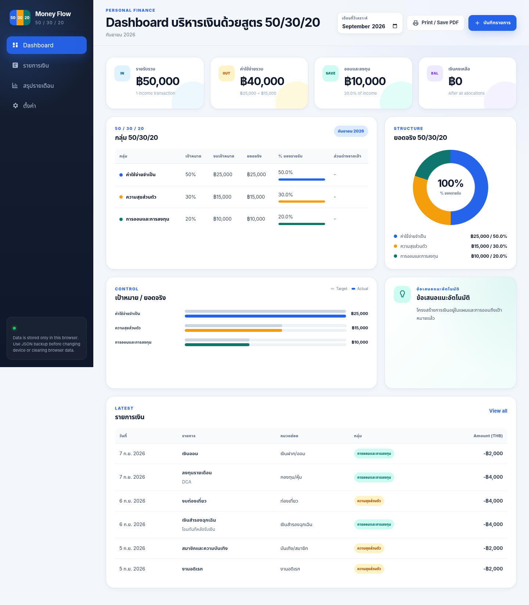

# Money Flow – Web Dashboard 50/30/20

Dashboard สำหรับจัดการรายรับตามสูตร 50/30/20 ใช้งานได้ทั้งคอมพิวเตอร์ แท็บเล็ต และโทรศัพท์ โดยไม่ต้องติดตั้งฐานข้อมูลหรือระบบ Build

## จุดที่ปรับปรุงใน Version 2

- แก้ Mobile UI ให้ข้อมูลไม่ถูกตัดด้านขวา
- เปลี่ยนตาราง 50/30/20 รายการเงิน และสรุปรายเดือนให้เป็นการ์ดเมื่อเปิดบนโทรศัพท์
- แสดงเป้าหมาย งบเป้าหมาย ยอดจริง เปอร์เซ็นต์ ส่วนต่าง และสถานะครบทุกช่อง
- แสดงจำนวนเงินของแต่ละรายการบน Mobile ครบถ้วน
- เพิ่มชื่อเมนูใต้ไอคอนบน Mobile
- ทำ `index.html` เป็นไฟล์แบบ Standalone มี CSS และ JavaScript อยู่ภายในไฟล์เดียว
- ป้องกันปัญหา UI ไม่สมบูรณ์จากการอัปโหลดโฟลเดอร์ `assets` ไม่ครบ

## วิธีนำขึ้น GitHub Pages

1. สร้าง Repository ใหม่ใน GitHub
2. อัปโหลดไฟล์ `index.html` ไว้ที่หน้าแรกของ Repository
3. อัปโหลด `.nojekyll` และไฟล์อื่นในชุดนี้ได้ตามปกติ
4. เปิด `Settings > Pages`
5. เลือก `Deploy from a branch`
6. เลือก Branch `main` และ Folder `/(root)`
7. กด `Save`

ไฟล์สำคัญจริง ๆ สำหรับเปิด Dashboard คือ `index.html` เพียงไฟล์เดียว

## ฟังก์ชันหลัก

- Dashboard รายรับ ค่าใช้จ่าย เงินออม/ลงทุน และเงินคงเหลือ
- เปรียบเทียบเป้าหมายกับยอดจริงตามสูตร 50/30/20
- กราฟสัดส่วนเงินจริงและกราฟเปรียบเทียบเป้าหมาย
- เพิ่ม แก้ไข ลบ ค้นหา และกรองรายการเงิน
- สรุปผลรายเดือนและอัตราการออมรายปี
- ปรับสัดส่วน หมวดย่อย และช่องทางชำระเงิน
- Export CSV
- Backup และ Restore ด้วย JSON
- Print หรือ Save เป็น PDF
- บันทึกข้อมูลด้วย `localStorage` ภายในเบราว์เซอร์

## การเก็บข้อมูล

ข้อมูลที่กรอกจะเก็บอยู่ในเบราว์เซอร์ของอุปกรณ์นั้น ไม่ถูกบันทึกลง GitHub และไม่ Sync ข้ามอุปกรณ์โดยอัตโนมัติ ควรใช้ `Backup JSON` ก่อนล้างข้อมูลเบราว์เซอร์หรือย้ายอุปกรณ์

## โครงสร้างไฟล์

- `index.html` – Dashboard แบบ Standalone พร้อมใช้งานทันที
- `preview.png` – ภาพตัวอย่าง Desktop
- `mobile-preview.png` – ภาพตัวอย่าง Mobile
- `assets/` – Source แยกไฟล์สำหรับผู้ที่ต้องการแก้ CSS หรือ JavaScript
- `index.source.html` – HTML ต้นฉบับที่อ้างอิง Source ในโฟลเดอร์ `assets`
- `.nojekyll` – ให้ GitHub Pages เสิร์ฟไฟล์ Static โดยตรง
